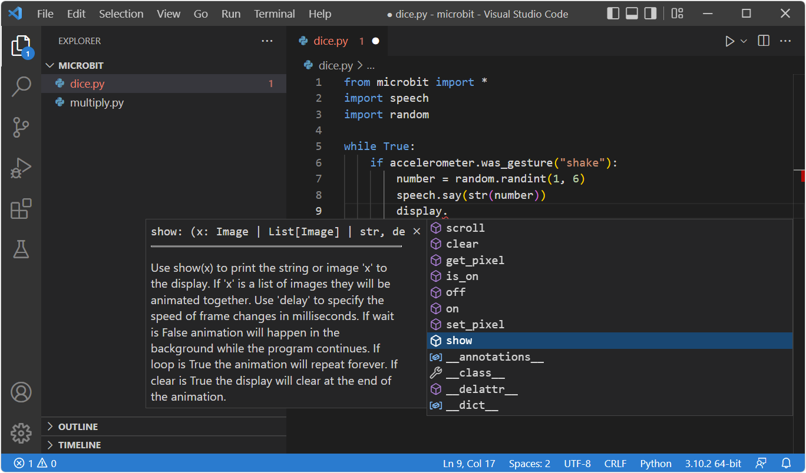
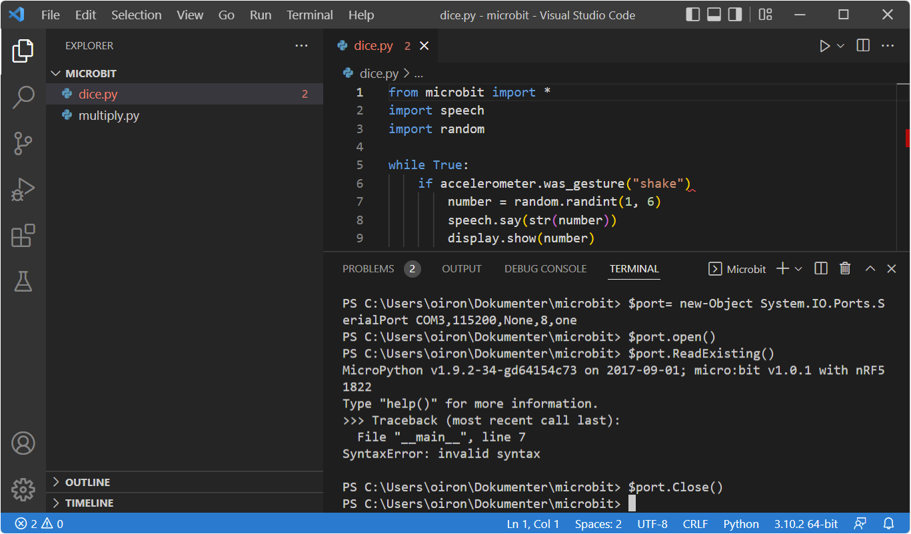

# microbit extension for Visual Studio Code


A Visual Studio Code extension for students who code the BBC micro:bit with [Python](https://www.python.org/). It supports micro:bit V1 and V2 and also the [4tronix Bit:Bot XL](https://shop.4tronix.co.uk/collections/bit-bot/products/bitbotxl) robot.

The extension makes it easy to flash your micro:bit with your Python script. It provides type hints and easy access to warnings and errors in your script. It also provides access to runtime errors that happen on the micro:bit by accessing the REPL (Read-Evaluate-Print-Loop).

The extension is supported by Visual Studio Code on Windows only.

## Table of Contents
- [Features](#features)
- [How to use](#how-to-use)
- [Available Commands and keyboard short cuts](#available-commands-and-keyboard-short-cuts)
- [Installed files](#installed-files)
- [Workspace settings](#workspace-settings)
- [Release Notes](#release-notes)


*Visual Studio Code with type hints for micro:bit.*

## Features

* Provides type hints.
* Supports both micro:bit V1 and V2.
* Supports the micro:bit accessory [4tronix Bit:Bot XL](https://shop.4tronix.co.uk/collections/bit-bot/products/bitbotxl) robot.
* Flashes the micro:bit with your script.
* Reads error messages from the micro:bit (REPL).

## How to use

### Getting started

1. Install [Python](https://www.python.org/) on your system. (You will need to Add Python to PATH.)
2. Create a new folder/workspace in Visual Studio Code.
3. Open Extensions view (__Ctrl+Shift+X__) and make sure you have the [Python extension from Microsoft](https://marketplace.visualstudio.com/items?itemName=ms-python.python) installed.
4. From Extensions view, search for and install this extension ('__microbit__' from publisher Statped).
5. Restart Visual Studio Code.
6. Open Command Palette (__Ctrl+Shift+P__) and select __micro:bit Prepare__. This will [install files to your system](#installed-files).
7. Restart Visual Studio Code.
8. Write your Python script for micro:bit or 4tronix Bit:Bot XL.
9. Flash your micro:bit using __Ctrl+F5__ (or Command Palette __micro:bit Flash__).


*Use the Read micro:bit (REPL) command to read errors on the micro:bit unit.*

### Read error messages

The Problems Panel (__Ctrl+Shift+M__) shows warnings and errors that happen during coding. However, there might be errors that only happen during runtime. This extension allows you to read runtime errors from the micro:bit by accessing the REPL (Read-Evaluate-Print-Loop). But first, make sure Visual Studio Code knows the micro:bit COM port:

1. Open Windows Device Manager (__Win+X, Device Manager__) to find the micro:bit COM port.
2. Open Command Palette (__Ctrl+Shift+P__) and select __micro:bit: Set COM port__.
3. Enter the COM port number from the Device Manager.
4. Make sure your script is running on the micro:bit, and then:
5. Open Command Palette and select __micro:bit: Read micro:bit (REPL)__ or press __Ctrl+Alt+F5__.
6. Any error messages will be written to the Terminal panel.

## Available Commands and keyboard short cuts

| Command                              | Keyboard        | Description                                              |
| -----------                          | -----------     | -----------                                              |
| __micro:bit: Flash__                 | __Ctrl+F5__     | Flash your micro:bit with the currently open script.     |
| __micro:bit: Prepare__               | N/A             | Installs workspace settings and Python modules to your system.                |
| __micro:bit: Set COM port__          | N/A             | Set the micro:bit COM port.|
| __micro:bit: Read micro:bit (REPL)__ | __Ctrl+Alt+F5__ | Read error messages from the micro:bit.                    |
| __Show notifications list__          | __Ctrl+Alt+N__  | Access the Notifications list.                           |

## Installed files

In order to make all the features work as intended, the extension will install files to your system:

### Your workspace
* .microbit-stubs (stub files for microbit)
* .env (environment file for Python)
* .vscode ([settings.json](#workspace-settings))

### Pythons third-party modules location
* Python module [bitbotxl.py](https://pypi.org/project/bitbotxl/)
* Other required modules

## Workspace settings

The following settings are added to the workspace:

```
"python.languageServer": "Pylance",
"python.linting.enabled": true,
"python.linting.pylintEnabled": true,
"python.analysis.autoSearchPaths": true,
"python.autoComplete.extraPaths": [
    ".microbit-stubs/microbit/lib"
],
"python.analysis.extraPaths": [
    ".microbit-stubs/microbit/lib"
],

"files.exclude": {
    ".microbit-stubs": true,
    ".vscode": true,
    ".env": true
},
"python.envFile": "${workspacefolder}/.env",

"python.linting.pylintArgs": [
    "--disable=W0614", // unused-wildcard-import
    "--disable=C0111", // missing-docstring
    "--disable=W0401", // wildcard-import
    "--disable=C0411", // wrong-import-order
    "--disable=C0413", // wrong-import-position
    "--disable=E0401", // import-error
    "--disable=C0303", // trailing-whitespace
    "--disable=C0305"  // trailing-newlines
]
```

## Release Notes

## [1.0.9] - 2022-06-16

* Removed experimental feature allowing installation of third-party Python modules to $env:userprofile.
* Removed deprecated Pylint argument from workspace settings: disable=C0326 (bad-whitespace).
* Replaced icon.
* Updated Readme.
* Bug fixes.
* npm updates.